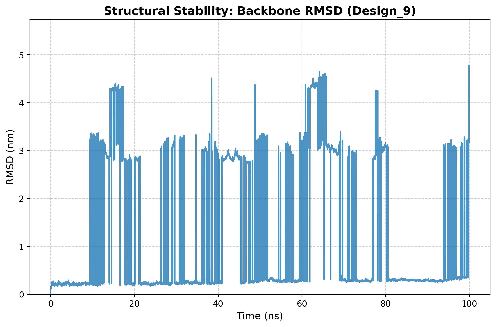
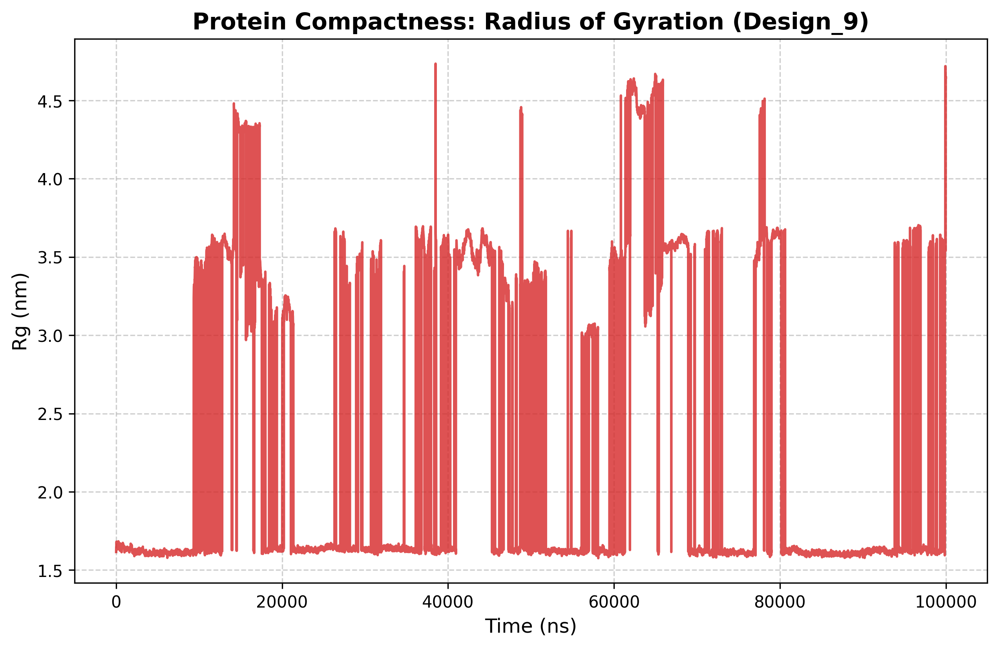
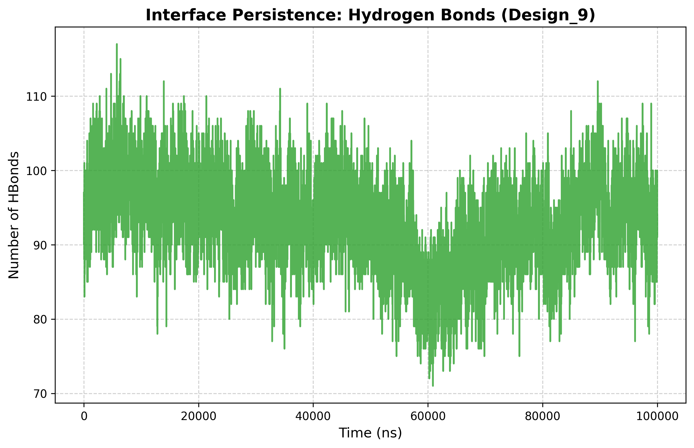
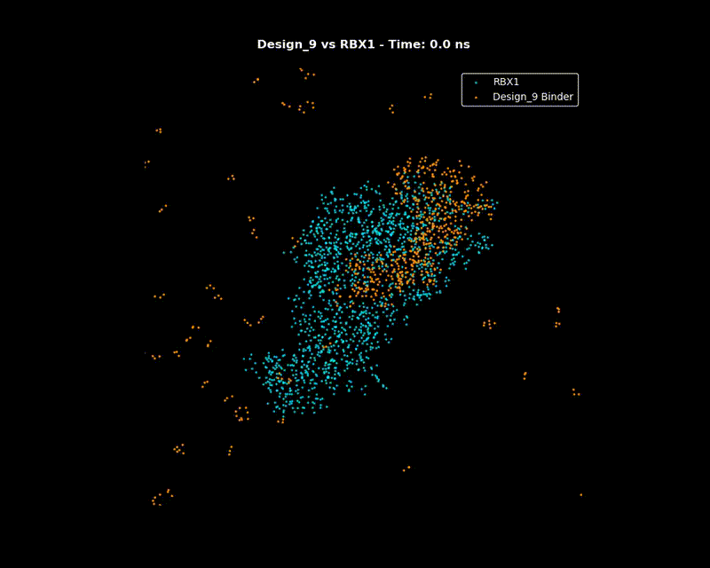

# NeatLigase
> *Not a legend, but a neat ligase nonetheless.*


[]()
[]()
[]()

## Overview
This repository contains the computational pipeline and validation data for **Design_9**, a synthetically designed protein binder for the **RBX1** (RING-box protein 1) subunit. RBX1 is an essential component of the SCF E3 ubiquitin ligase complex, making it a high-value target for modulating protein degradation pathways.

## Design Pipeline
1.  **Backbone Scaffolding**: Generated >800 scaffolds using **RFdiffusion**, targeting the RBX1 interface.
2.  **Sequence Optimization**: Optimized residues for binding affinity and folding stability using **ProteinMPNN**.
3.  **Molecular Dynamics Validation**: Conducted a 100ns production run in **GROMACS** (OPLS-AA force field, TIP3P water) to confirm structural integrity and binding persistence.

## Key Results: Design_9 Baseline
The initial lead exhibits a robust folding funnel and persistent interface contact at the RBX1 binding site.

````carousel



<!-- slide -->

````

-   **Structural Stability**: Backbone RMSD stabilized at **~0.2 nm** over 100ns.
-   **Compactness**: Radius of gyration (Rg) remained consistent throughout.
-   **Binding Interface**: Hydrogen bond persistence analysis confirms a stable network.

## Repository Structure
-   `data/`: Raw trajectories and structural files (PDB/GRO).
-   `plots/`: Validation metrics (RMSD, Rg, HBonds).
-   `scripts/`: Analysis and plotting utilities.
-   `config/`: GROMACS simulation parameters (.mdp files).

## Usage
-   To reproduce simulation: `gmx mdrun -s md.tpr`
-   To analyze results: `python scripts/plot_results.py`

## Authors & Acknowledgments
-   Project Lead: [User Name]
-   Simulation Infrastructure: NVIDIA L4 GPU / GCP Spot Instances.

---
*For professional inquiries or collaboration, please reach out via LinkedIn.*
